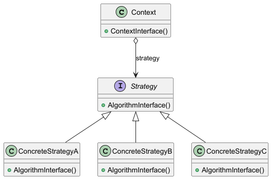

## Strategy Design Pattern
## Intent

The **Strategy Pattern** in Java allows you to define a family of algorithms, encapsulate each one in a separate class,
and make them interchangeable without modifying the client code. It promotes flexibility by enabling dynamic selection
or switching of algorithms at runtime based on the application's needs.

## Motivation

The Strategy Patterns was created to enable flexibility by decoupling algorithms from their usage context, allowing
dynamic swapping of behaviours without altering the client code.

## Applicability

The **Strategy Pattern** is applicable when multiple algorithms exist for a task, and you want to switch them
dynamically, or when you need to avoid conditional logic for selecting behaviours.

## Structure

## Participants

- **Strategy** 
  - defines a common interface (**Strategy**) for a family of interchangeable algorithms, allowing the context to use different strategies dynamically without altering its behavior.
- **ConcreteStrategy**
    - implements the algorithm using the Strategy interface.
- **Context**
  - maintains a reference to a Strategy object and interacts with it exclusively through the **Strategy** interface, enabling dynamic strategy changes at runtime.

## Consequences
- **Families of related algorithms:** 
  - Encapsulates related algorithms in separate classes, making them interchangeable.
- **An alternative to subclassing:** 
  - offers an alternative approach to support multiple algorithms through inheritance, but it introduces rigidly by embedding the behavior directly into the **Context**, making it hardcoded and preventing dynamic changes to the algorithm a runtime.
- **Strategies eliminate conditional statements:** 
  - provides a substitute for using conditional statements to choose specific behaviors.
- **Choice of implementation** 
  - allows the client to select from a range of different implementations, enabling the choice of a strategy without incurring time or space trade-offs.
- **Clients must bw aware of different Strategies:** 
  - Clients must understand the difference between strategies to select the appropriate one. Therefore, the pattern should only be used when it is relevant to the client to avoid unnecessary exposure to implementation details.
- **Communication overhead between Strategy and Context:** 
  - The Strategy interface is shared by all **ConcreteStrategy classes, but not all strategies may use all the data passed through it, potentially causing redundant parameter initialization. This can lead to overhead due to unnecessary object creation and data processing.
- **Increased number of objects.**
