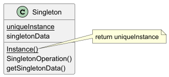

## Singleton Design Pattern

## Intent

A creational design pattern that ensures a class has only one instance and provides a global point of access to it.

## Motivation

This pattern is particularly useful in scenarios like managing configurations, logging, caching or database connections,
where a single share resource is necessary to coordinate actions across the system.

## Applicability

Use the Singleton pattern when

- there must be exactly one instance of a class.
- the sole instance allows to be extended through subclassing, enabling clients to utilize the extended version without
  altering their existing code.

## Structure

## Participants

- **Singleton**
    - ensures only one instance exists and provides a global access point to it. This is achieved by making the
      constructor private and offering a static method that returns the sole instance.
- **Client**
    - Access the Singleton instance through its static method, utilizing the shared resource without creating new
      instances.

## Consequences

- **Controlled access to the sole instance:**
    - Because the Singleton class encapsulates its sole instance, it can have strict control over how and when clients
      access it.
- **Reduced name space:**
    - improves upon global variables. This approach prevents cluttering the global namespace with variables that hold
      sole instances, thereby maintaining a cleaner and more maintainable codebase.
- **Permits refinement of operations and representations:**
    - allows a subclass to be subclassed, enabling the application to be configured at runtime with an instance of the
      subclass without modifying existing client code . This flexibility permits the refinement of operations and
      representations by substituting the Singleton instance with a more specialized version as needed.
- **Permits a variable number of instances:**
    - To allow multiple instances of a class while controlling their number, modify the method that grants access to
      these instances. This approach enables you to manage the exact number of instances created, offering flexibility
      beyond the traditional Singleton pattern. By adjusting the instance-access method, you can implement patterns like
      the Multiton, which allows for a controlled number of instances, each associated with a specific key.
